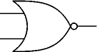
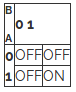
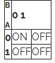
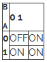
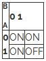
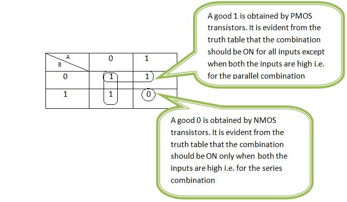

### NAND Gate

The NAND gate has one output and two or more inputs. The output is low only when all inputs are high; otherwise, it is high. A NAND gate can be viewed as an AND gate followed by an inverter.

**Schematic:**

**Truth Table:**

| Input A | Input B | Output |
| ------- | ------- | ------ |
| 0       | 0       | 1      |
| 0       | 1       | 1      |
| 1       | 0       | 1      |
| 1       | 1       | 0      |

---

### NOR Gate

The NOR gate has one output and two or more inputs. The output is high only when all inputs are low; otherwise, it is low. A NOR gate can be viewed as an OR gate followed by an inverter.

**Schematic:**

**Truth Table:**

| Input A | Input B | Output |
| ------- | ------- | ------ |
| 0       | 0       | 1      |
| 0       | 1       | 0      |
| 1       | 0       | 0      |
| 1       | 1       | 0      |

---

### Series and Parallel Connections in CMOS

**Series connection of NMOS devices:**

**Series connection of PMOS devices:**

If switches are connected in parallel, the composite switch is closed when either or both switches are closed. The parallel connection is shown below. The table indicates the states of the switch obtained by parallel connection depending on the inputs A and B.

**Parallel connection of NMOS devices:**

**Parallel connection of PMOS devices:**

---

By using combinations of the above constructions, CMOS combinational gates can be obtained. In the following section, Karnaugh maps for NAND and NOR have been used to determine the required combination.

### K-Map for NAND

For NAND gate, PMOS devices are connected in parallel between Vdd and output node, whereas NMOS devices are in series between output node and ground.

### K-Map for NOR

For NOR gate, PMOS devices are connected in series between Vdd and output node, whereas NMOS devices are in parallel between output node and ground.
