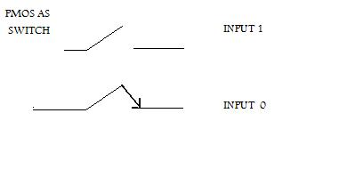
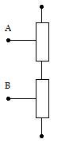
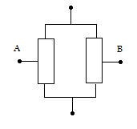

**SWITCHING BEHAVIOUR OF TRANSISTOR**

The gate of the MOS transistor controls the passage of the current between the drain and source.If the voltage at the gate is Vdd, no current flows between the drain and source of PMOS and same is the case with NMOS if its gate is grounded. This characteristic of MOS transistors, enables it to be viewed as a switch. The switching behaviour of nmos and pmos device is shown in the figure below. Here the input 0 indicates that the gate is grounded and input 1 indicates that Vdd is applied to the gate:

**SERIES AND PARALLEL CONNECTION**

The transistor level schematic of any combinational logic can be obtained by placing two or more n/p-switches in series or parallel.

If switches are connected in series then the composite switch hence constructed is closed when both the switches are closed. The series connection is shown in the figure below. The table indicates the states of the switch contructed by series connection depending on the inputs A and B

Series connection of NMOS devices

|B  |          |
|A  |	0 1      |
|---|----------|
|0  | OFF |OFF |
|1  |	OFF | ON |

Series connection of PMOS devices
B
A 	0 1mq
1 	ON 	OFF
OFF 	OFF

If the switches are connected in parallel then the composite switch hence constructed is closed when either or both of the switches are closed. The parallel connection is shown in the figure below. The table indicates the states of the switch obtained by parallel connection depending on the inputs A and B
Parallel connection of NMOS devices

B
A 	0 1
0
1 	OFF 	ON
ON 	ON

Parallel connection of PMOS devices
B
A 	0 1
0
1 	ON 	ON
ON 	OFF

By using any combinations of the above constructions, CMOS combinational gates can be obtained. In the following section, Karnaugh maps for NAND and NOR have been used to determine the required combination

**K-MAP FOR NAND**

Thus for NAND gate PMOS devices are connected in parallel between Vdd and output node, whereas the NMOS devices are in series between output node and ground.

**K-MAP FOR NOR**

Thus for NOR gate PMOS devices are connected in series between Vdd and output node, whereas the NMOS devices are in parallel between output node and ground.
